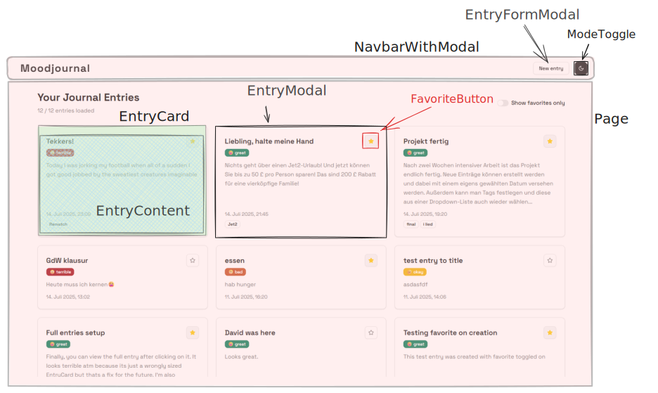

# Moodjournal 

## Modular overview

## Instructions for running locally

After cloning the repository, you have two options. You can either use the script I have written to have the project up and running with a single command or manually perform the steps.

### Fully automated setup

1. `npm run dev:first` will run a combination of custom scripts, which install all requirements, create the local environment file, create the database migration file, perform the migrations to create the tables in the database and run the dev server. This is only required for the very first execution after cloning.
2. Subsequent runs can simply use `npm run dev` instead. While `npm run dev:first` will also work, the additional steps are no longer required.

### Fully manual setup

1. Run `npm run install` in the project directory to install the required packages.
2. Run the command `echo 'DATABASE_URL=file:./dev.db' > .env.local` to create a local environment file, which points the project to the database location. The database file itself will be created later automatically.
3. Run `npx drizzle-kit generate` to create the database migrations based on the drizzle schema.
4. Run `npx drizzle-kit migrate` to perform the migrations on the dev.db database file.
5. Run `npm run dev` to start the development server.

## Implemented features

### Mandatory features

1. All journal entries are displayed.
   1. The newest entry is displayed first.
   2. Each entry shows the title, the creation date, the content and the mood.
2. Creation and display of new entries
   1. An entry consists of a title and a content of variable length.
   2. A new entry is assigned the current date during creation.
3. Important entries can be highlighted.
   1. Highlighted entries are easily accessible, e.g. through a separate list or filters.
   2. Highlights can be dynamically set and removed by the user, so they are added or removed from the filter view
   3. Highlighted entries can be visually differenciated from normal entries
4. Entries only show 250 symbols of content.
   1. If the content is shorter than 250 symbols, the entire content is shown.
   2. For longer content, the user can show the full entry through an interaction.

### Optional features

1. Journal entries are saved persistently either in a lcoal sqlite database or in a turso database instance. Those entries are redisplayed on application launch.
2. Users can set an alternative creation date for the entries, but only for past dates.
3. New entries can be marked with tags
   1. Tags are displayed for each entry
   2. Previous tags are suggested while typing
   3. New tags can be set during entry creation and are suggested on future creations
4. Not all entries are immediately loaded. Additional entries are either loaded manually or through user interaction
   1. The chronological order of the entries remains

## Tests

The project contains 3 Jest test suites with 8 tests in total, which can be run by executing `npm run test` after setting up the project.

### Mandatory feature 1: Display all entries

[Related test file: entries-list.test.jsx](__tests__/entries-list.test.jsx)

This is an unit test for the display of entries. It mocks the API and serves the entries already sorted chronologically. After the page has been rendered, 3 individual tests check, whether the title, content, and timestamp are present for each entry.

### Mandatory feature 3: Favorites

[Related test file: favorites-filter.test.jsx](__tests__/favorites-filter.test.jsx)

This is an integration test, focusing on the functionality of the favorites functions and the display in the page. It initially renders the page, then simulates a user event by clicking on the favorites switch, then checking if only the favorites have remained on the page. The second test in this suite toggles the favorite status of an entry by performing a click on the button, then toggles the favorites switch to ensure, that both favorited entries are now shown on the page.

### Mandatory feature 4: Content preview

[Related test file: entry-preview.test.jsx](__tests__/entry-preview.test.jsx)

This is an unit test for the EntryContent component, which is responsible for ensuring, that only 250 characters of the content are displayed on the regular view. I have generated a lorem ipsum text with a length of 300 bytes, so the test ensures that short strings are fully displayed and longer strings are truncated and concatenated with "...". Finally, if the EntryContent is being shown in a modal, which is the full expanded view, the long text should also be displayed fully.
